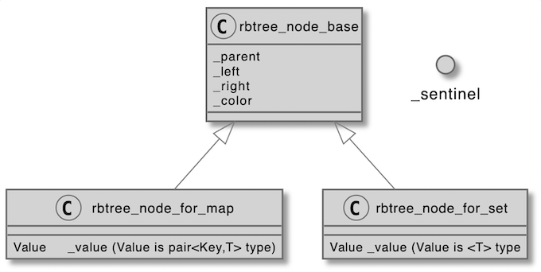

# C++ containers

[The project description and requirements](docs/containers_subject.pdf)

References for the containers prototypes, attributes and methods: [cplusplus.com](https://www.cplusplus.com/) and [cppreference.com](https://en.cppreference.com/w/)

The goal of the project is to understand how C++ containers work by implementing my's own version replicating the behavior of STL containers.

The subject requires the use of **namespace ft** to differentiate the reproduced containers from those available in the standard library.


The following STL containers are implemented:
- Stack
- Vector
- Map
- Set


### Stack
  is a container adaptor that gives the programmer the functionality of a stack - specifically, a LIFO (last-in, first-out) data structure.
Stack cannot be iterable and only the top element can be accessed.
```ft::vector``` is used as an underlying container for my ```ft::stack```

### Vector
  is a sequence container that encapsulates dynamic size arrays.
Vector iterator class is also implemented, as well as a number of arithmetic and relational operators.

### Map
  is a sorted associative container that contains key-value pairs with unique keys. Keys are sorted by using the comparison function Compare. Search, removal, and insertion operations have logarithmic complexity. Maps are usually implemented as red-black trees.

### Set
  is also an associative container that contains a sorted set of unique objects of type Key.
The basic difference between Set and Map is that Map contains the data in the key-value pair while Set is storing keys only.

 #### Red Black Tree
A red-black tree is a binary search tree with one extra bit of storage per node: its
color, which can be either RED or BLACK. By constraining the node colors on any
simple path from the root to a leaf, red-black trees ensure that no such path is more
than twice as long as any other, so that the tree is approximately **balanced.**

**The tree satisfies the following red-black properties:**
1. Every node is either red or black.
2. The root is black.
3. Every leaf (NIL) is black.
4. If a node is red, then both its children are black.
5. For each node, all simple paths from the node to descendant leaves contain the
same number of black nodes.

  
  
Node holding the key **26** in the picture is the **root** node.

As a matter of convenience in dealing with boundary conditions in red-black
tree code, a single **sentinel** to represent NIL is used.
We use the sentinel so that we can treat a NIL child of a node x as an ordinary
node whose parent is x. Although we instead could add a distinct sentinel node
for each NIL in the tree, so that the parent of each NIL is well defined, that approach would waste space.

The **sentinel's parent** is always pointing to the root(it is updated if the root is changed) which is helpful for handling the situations
when the iterator returned by **end()** is decremented and dereferenced.
```
ft::map<int, int>::iterator iter = my_map.end();
iter--;
std::cout << "The key is << iter->first << std::endl;
```
##### Nodes
The sentinel node doesn't hold a value and is an object of the **rbtree_base** class thus having only _color_, _left_, _right_ and _parent_ attributes.
This structure allows to escape 2 problems: 
- any object constructed from a class without a default constructor can be saved in a Map/Set node;
- no unnecessary additional memory is allocated that can be a problem for a potentially heavily weighted objects;



### Iterators
The subject demands iterator system(including ```reverse_iterator```) implementation for the containers that have it. It was true for 3 of the containers: vector, map and set(the last two are using the red black tree iterators). The arithmetic and relational operators for the cases where it was applicable were added.
I also had to implement a [**type conversion operator**](https://en.cppreference.com/w/cpp/language/cast_operator) for the conversion from non-const to const as I had to stick to one of the weird subject requirements to use ```friend``` keyword for non-member overloads only.
```
// type conversion operator
operator const_iterator_type() const
{
  return const_iterator_type(_ptr);
}
```
  Iterator_traits had to be reimplemented.
 
## Tests

Unit tests are divided into two parts:
- one is based on the Catch2 framework and is mostly comparing containers to their STL counterparts;
- the other one is writing output values to the stream(demanded by the project subject).
Namespace _ft_ can be replaced by _std_ with the define flag(-D=STD) and the output can be redirected to a file.

For example:
```
clang++ tests/mandatory_tests/*.cpp  -o ft_containers  && time ./ft_containers > ft.txt
clang++ tests/mandatory_tests/*.cpp -D=STD -o std_containers && time ./std_containers > std.txt
```
Or just run
```
./run_tests.sh
```
and then
```
./run_catch_tests.sh
```
Time command can be used to compare the tests execution time. The subject demands the replica cannot be more than 20 times slower than the original.
**Real** is wall clock time - time from start to finish of the call. 
**User** is the amount of CPU time spent in user-mode code (outside the kernel) within the process. 
**Sys** is the amount of CPU time spent in the kernel within the process.


If you've noticed mistakes or other issues in the description please let me know.


Sources:
- [Red Black Tree description](https://edutechlearners.com/download/Introduction_to_algorithms-3rd%20Edition.pdf)
